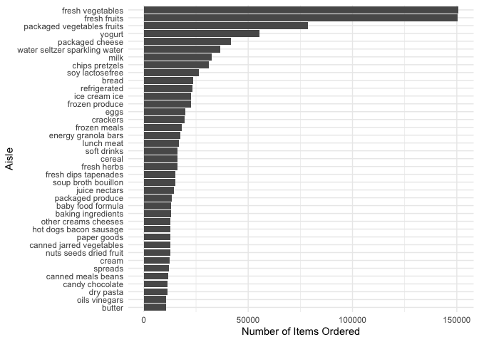
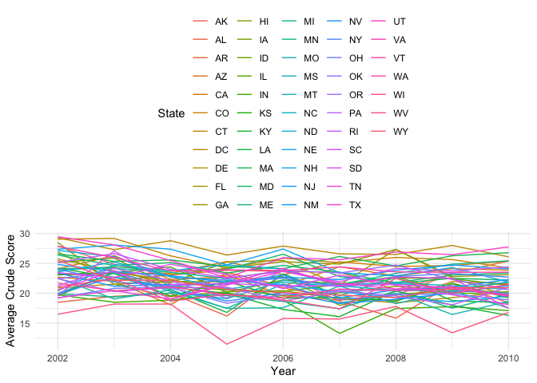
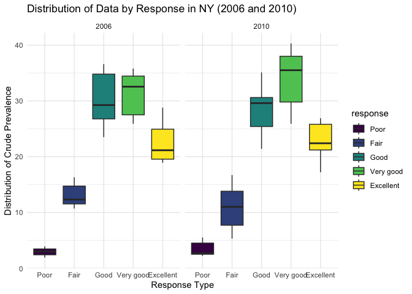

p8105_hw3_xh2636
================
Xiaoyu Huang
2023-10-09

# Problem 1

``` r
library(p8105.datasets)
library(tidyverse)
```

    ## ── Attaching core tidyverse packages ──────────────────────── tidyverse 2.0.0 ──
    ## ✔ dplyr     1.1.3     ✔ readr     2.1.4
    ## ✔ forcats   1.0.0     ✔ stringr   1.5.0
    ## ✔ ggplot2   3.4.3     ✔ tibble    3.2.1
    ## ✔ lubridate 1.9.2     ✔ tidyr     1.3.0
    ## ✔ purrr     1.0.2     
    ## ── Conflicts ────────────────────────────────────────── tidyverse_conflicts() ──
    ## ✖ dplyr::filter() masks stats::filter()
    ## ✖ dplyr::lag()    masks stats::lag()
    ## ℹ Use the conflicted package (<http://conflicted.r-lib.org/>) to force all conflicts to become errors

``` r
library(ggplot2)
data("instacart")
```

The dataset has 1384617 observation and 15 variables. The key variable
in the dataset are their “ids”, “aisle”, and “department name”. Also, we
can see the data set contain different product name.

``` r
# Find number aisles are the most items ordered from and rank it
rank_aisle <- instacart %>%
  group_by(aisle) %>%
  summarize(total_ordered = n())%>%
  arrange(-total_ordered)
rank_aisle
```

    ## # A tibble: 134 × 2
    ##    aisle                         total_ordered
    ##    <chr>                                 <int>
    ##  1 fresh vegetables                     150609
    ##  2 fresh fruits                         150473
    ##  3 packaged vegetables fruits            78493
    ##  4 yogurt                                55240
    ##  5 packaged cheese                       41699
    ##  6 water seltzer sparkling water         36617
    ##  7 milk                                  32644
    ##  8 chips pretzels                        31269
    ##  9 soy lactosefree                       26240
    ## 10 bread                                 23635
    ## # ℹ 124 more rows

The are 134 aisles, and aisle have the most items ordered from is fresh
vegetable.

``` r
# limiting this to aisles with more than 10000 items ordered.
aisle_counts <- table(instacart$aisle)
popular_aisles <- names(aisle_counts[aisle_counts > 10000])
```

``` r
# Make a plot that shows the number of items ordered in each aisle
instacart %>%
  count(aisle) %>%
  filter(n > 10000) %>%
  arrange(desc(n)) %>%
  mutate(aisle = fct_reorder(aisle, n)) -> filtered_data

aisle_order_plot <- ggplot(filtered_data, aes(x = aisle, y = n)) +
  geom_bar(stat = "identity") +
  coord_flip() +
  labs(x = "Aisle", y = "Number of Items Ordered") +
  theme_minimal()

print(aisle_order_plot)
```

<!-- -->

We can see the arrangement of these data from high to low, and we can
see that there are 39 categories with more than 10,000 quantities, and
fresh vegetable has the largest number. Butter accounts for the smallest
proportion here.

``` r
# Make a table showing the three most popular items
three_mpi <- instacart %>%
  filter(aisle %in% c("baking ingredients", "dog food care", "packaged vegetables fruits"))

# Group aisle and product name
aisle_product_counts <- three_mpi %>%
  group_by(aisle, product_name) %>%
  summarise(order_count = n())%>%
  arrange(aisle, desc(order_count))

# Rank the items within each aisle by order count
aisle_product_counts <- aisle_product_counts %>%
  group_by(aisle) %>%
  mutate(rank = rank(-order_count))
top_items <- aisle_product_counts %>%
  filter(rank <= 3)
top_items <- top_items %>%
  select(aisle, rank, product_name, order_count)

print(top_items)
```

    ## # A tibble: 9 × 4
    ## # Groups:   aisle [3]
    ##   aisle                       rank product_name                      order_count
    ##   <chr>                      <dbl> <chr>                                   <int>
    ## 1 baking ingredients             1 Light Brown Sugar                         499
    ## 2 baking ingredients             2 Pure Baking Soda                          387
    ## 3 baking ingredients             3 Cane Sugar                                336
    ## 4 dog food care                  1 Snack Sticks Chicken & Rice Reci…          30
    ## 5 dog food care                  2 Organix Chicken & Brown Rice Rec…          28
    ## 6 dog food care                  3 Small Dog Biscuits                         26
    ## 7 packaged vegetables fruits     1 Organic Baby Spinach                     9784
    ## 8 packaged vegetables fruits     2 Organic Raspberries                      5546
    ## 9 packaged vegetables fruits     3 Organic Blueberries                      4966

We selected the top three comprehensive rankings from these three
categories, so that we can read this table more intuitively. And we can
see that the number of vegetable orders is the highest, far exceeding
the number of dog food care.

``` r
hour_day <- instacart %>%
  filter(product_name %in% c("Pink Lady Apples", "Coffee Ice Cream"))

# Extract day of the week and hour of the day from the "order_hour_of_day" column
hour_day <- hour_day %>%
  mutate(day_of_week = weekdays(as.Date(order_dow, origin = "1990-01-01")),
         hour_of_day = order_hour_of_day)

# Calculate the mean hour of the day for each product on each day of the week
myday <- hour_day %>%
  group_by(product_name, day_of_week) %>%
  summarise(mean_hour = mean(hour_of_day, na.rm = TRUE)) %>%
  pivot_wider(names_from = day_of_week, values_from = mean_hour)

# Specify the order of days of the week
day_order <- c("Monday", "Tuesday", "Wednesday", "Thursday", "Friday", "Saturday", "Sunday")
myday <- myday %>%
  select(product_name, day_order)
print(myday)
```

    ## # A tibble: 2 × 8
    ## # Groups:   product_name [2]
    ##   product_name     Monday Tuesday Wednesday Thursday Friday Saturday Sunday
    ##   <chr>             <dbl>   <dbl>     <dbl>    <dbl>  <dbl>    <dbl>  <dbl>
    ## 1 Coffee Ice Cream   13.8    14.3      15.4     15.3   15.2     12.3   13.8
    ## 2 Pink Lady Apples   13.4    11.4      11.7     14.2   11.6     12.8   11.9

From the data we compiled, we can see that for coffee ice cream, Tuesday
has the largest average value and Friday has the smallest average value.
On the other hand, pink lady apple has the largest average on Tuesday
and the smallest on Sunday.

\#Problem 2

``` r
library(p8105.datasets)
data("brfss_smart2010")
view(brfss_smart2010)
```

``` r
# Data cleaning 
brfss <- brfss_smart2010 %>%
  janitor::clean_names() %>%
  filter(topic == "Overall Health") %>%
  mutate(response = factor(response, levels = c("Excellent", "Very good", 
                                                "Good", "Fair", "Poor")))
# organize responses as a factor taking levels ordered from “Poor” to “Excellent”

view(brfss)
```

``` r
# states were observed at 7 or more locations at 2002
states_obv <- brfss%>%
  filter(year == "2002") %>%
  group_by(locationabbr)%>%
  summarise(count = n_distinct(locationdesc))%>%
filter(count >= 7)
print(states_obv)
```

    ## # A tibble: 6 × 2
    ##   locationabbr count
    ##   <chr>        <int>
    ## 1 CT               7
    ## 2 FL               7
    ## 3 MA               8
    ## 4 NC               7
    ## 5 NJ               8
    ## 6 PA              10

``` r
num_rol <- nrow(states_obv)
```

From the result we can see that total of 6 states is present in the
result. They are CT, FL, MA, NC, NJ, and PA are the states observed at 7
or more locations at the year of 2002.

``` r
# states were observed at 7 or more locations at 2010
states_obv <- brfss%>%
  filter(year == "2010") %>%
  group_by(locationabbr)%>%
  summarise(count = n_distinct(locationdesc))%>%
filter(count >= 7)
print(states_obv)
```

    ## # A tibble: 14 × 2
    ##    locationabbr count
    ##    <chr>        <int>
    ##  1 CA              12
    ##  2 CO               7
    ##  3 FL              41
    ##  4 MA               9
    ##  5 MD              12
    ##  6 NC              12
    ##  7 NE              10
    ##  8 NJ              19
    ##  9 NY               9
    ## 10 OH               8
    ## 11 PA               7
    ## 12 SC               7
    ## 13 TX              16
    ## 14 WA              10

``` r
num_x <- nrow(states_obv)
```

From the result we can see that total of 14 states is present in the
result. They are CA, CO, FL, MA, MD, NC, NE, NJ, NY, and OH are the
states observed at 7 or more locations at the year of 2010.

``` r
# dataset that limited to Excellent responses and averages the data_value across locations
limdata <- brfss %>%
  filter(response == "Excellent")%>%
  group_by(year, locationabbr) %>%
  summarize(average_data_value = mean(data_value, na.rm = TRUE))

# Draw the graph 
spaghetti_plot <- ggplot(limdata, aes(x = year, y = average_data_value, 
                             group = locationabbr, color = locationabbr)) +
  geom_line() +
  labs(x = "Year", y = "Average Crude Score", color = "State") +
  theme_minimal() +
  theme(legend.position = "top")
print(spaghetti_plot)
```

<!-- -->

As the graph shows, we can see that this graph is very complicated and
cannot clearly see the gaps and data distribution between each state.
But we can see that from 2002 to 2006, the average value of one state
dropped significantly. Beyond that, the average score across states
always seems to fall between 17 and 27, which is fairly evenly
distributed over the years.

``` r
ny_state <- brfss%>%
  filter(locationabbr == "NY", year %in% c(2006, 2010))%>%
  group_by(year)%>%

  ggplot(aes(x = response, y = data_value, fill = response)) +
  geom_boxplot() +
  facet_grid(year ~ .) +
  labs(title = "Distribution of Data by Response in NY (2006 and 2010)",
       x = "Response Type", y = "Distribution of Crude Prevalence") +
  theme_minimal()
print(ny_state)
```

<!-- -->

From the graph we can see that, for Excellent, the data in 2006 and 2010
are relatively stable. The biggest difference is the Good crowd.
Although the median in 2010 has not changed much compared to 2006, the
overall data range is lower than that in 2006. A lot. For Fair people,
the range in 2010 is obviously larger than the range in 2006. Therefore,
the prevalence score is positively related to the response type to a
certain extent.
